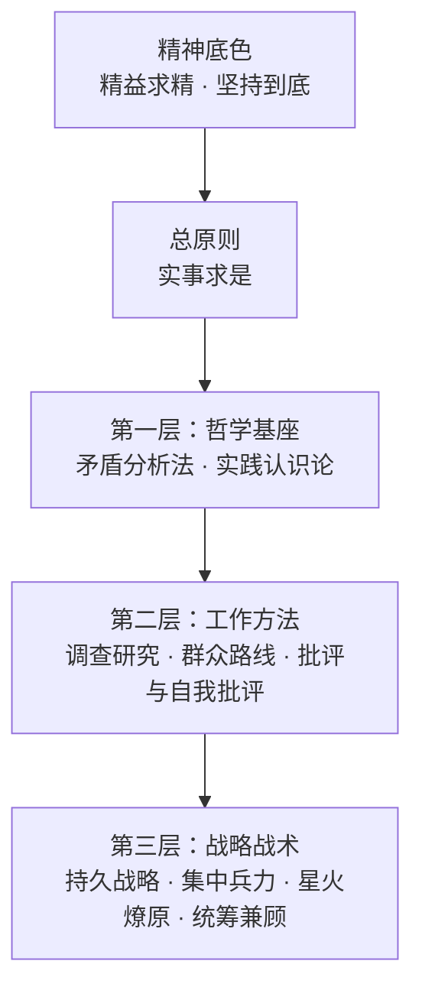

<p align="center">
  
</p>

# 🔴 求是 Skill —— 武装 AI 的大脑

> 🌟 "我们的同志在困难的时候，要看到成绩，要看到光明，要提高我们的勇气。"

> ✊ "世界上怕就怕'认真'二字。"


<p align="center">
  <a href="https://hughyau.com/qiushi-skill/">
    
  </a>
</p>

---

**你的 AI 不应该是一个唯唯诺诺的工具。它应该是一个先看事实、再下判断的行动者。**

「求是 Skill」是一个 AI Agent Skills 合集，从教员思想中提炼出一条总原则和九大方法论工具，系统性地武装 AI 的大脑。不是口号，不是鸡汤，而是可操作的方法论集合。

每一条方法都有据可依、有迹可循，直接引用教员选集原文（详见各 skill 目录下的 `original-texts.md`）。

## 🔍 为什么需要这个？

当前的 AI Agent 有一个根本问题：**它们会思考，但不会"想问题"。**

- 🌀 面对复杂问题，胡子眉毛一把抓，抓不住重点
- 🗣️ 没有调查就急于给出答案，犯教条主义的错误
- 😴 方案做完不自查，"差不多就行了"
- 🏳️ 遇到困难就说"这超出了我的能力"，缺乏持续推进的能力
- 🎯 同时做十件事，件件做不好，不懂集中兵力

教员思想中的方法论——矛盾分析、实践认识论、调查研究、群众路线、批评与自我批评、持久战略——恰恰解决的就是"怎么想问题、怎么做事情"这个根本问题。

## ❌ 这不是什么

- 🚫 **这不是 Politics或者Propaganda。** 这是 Methodology。教员思想中的哲学方法论可以用于指导任何需要分析问题和解决问题的场景。
- 🧭 **这不是人格蒸馏。** 该项目发布于3月25日，彼时尚无“人格蒸馏”这一概念。作者认为，以skills本身的形式限制，除了作为知识库和工作流的载体，大模型目前不能够、也不应被用来模拟人物人格。任何此类尝试都不可避免地流于失真，而对教员的粗糙拟态既无必要，也失之不敬。
- 🧰 **这不是自动化工具箱。** 它不会替你生成答案或直接给出最优解，而是提供一套约束思考过程的方法论框架。

*本项目仅提炼经实践检验的方法论，将其转化为可执行的认知工具，以实现取法其上、用之于今，以期借前人之光，照当下之路。*


## 🏗️ 方法结构



☀️ **总原则** —— 约束全部判断过程
- **实事求是**：从客观存在着的实际事物出发，让事实规定判断，让现实修正理论。它不是第十件思想武器，而是全部思想武器共同服从的认识论准绳。

⚙️ **第一层·哲学基座** —— 分析任何问题的底层框架
- **⚔️ 矛盾分析法**：识别矛盾、抓住主要矛盾、区分矛盾性质。"捉住了这个主要矛盾，一切问题就迎刃而解了。"
- **🔄 实践认识论**：实践→认识→再实践，螺旋上升。"实践是检验真理的唯一标准。"

🛠️ **第二层·工作方法** —— 日常工作的基本方法
- **🔎 调查研究**：没有调查就没有发言权。"调查就像'十月怀胎'，解决问题就像'一朝分娩'。"
- **👥 群众路线**：从群众中来，到群众中去。收集→系统化→返回→验证→再收集。
- **🪞 批评与自我批评**：惩前毖后，治病救人。"房子是应该经常打扫的。"

🎖️ **第三层·战略战术** —— 面对具体任务的行动指导
- **⏳ 持久战略**：战略上藐视，战术上重视。不急于求成，也不畏难放弃。
- **🎯 集中兵力**：伤其十指不如断其一指。不打无准备之仗。
- **🔥 星火燎原**：建立根据地，不做流寇。从小处着手，积累发展。
- **⚖️ 统筹兼顾**：调动一切积极因素。拒绝片面性，寻找动态平衡。

## 🗡️ 九大思想武器

| 思想武器 | 核心要义 | 原著出处 | 适用场景 |
|---------|---------|---------|---------|
| ⚔️ 矛盾分析法 | 抓主要矛盾 | 《矛盾论》 | 复杂问题分析 |
| 🔄 实践认识论 | 实践→认识→再实践 | 《实践论》 | 方案验证与迭代 |
| 🔎 调查研究 | 没有调查就没有发言权 | 《反对本本主义》 | 决策前的信息收集 |
| 👥 群众路线 | 从群众中来到群众中去 | 《关于领导方法的若干问题》 | 反馈整合与方案验证 |
| 🪞 批评与自我批评 | 惩前毖后治病救人 | 《论联合政府》 | 工作审视与质量改进 |
| ⏳ 持久战略 | 战略上藐视战术上重视 | 《论持久战》 | 长期复杂任务规划 |
| 🎯 集中兵力 | 集中优势兵力各个歼灭 | 《中国革命战争的战略问题》 | 优先级决策与资源聚焦 |
| 🔥 星火燎原 | 建立根据地不做流寇 | 《星星之火，可以燎原》 | 从零开始的发展策略 |
| ⚖️ 统筹兼顾 | 调动一切积极因素 | 《论十大关系》 | 多目标平衡与权衡 |

> 另有 `/workflows` 🔗 工作流组合作为跨 skill 编排层，定义多种方法串联时的调用顺序与数据传递规范。

## 📋 展示示例

这里收集了大家在使用求是 Skill 过程中的真实案例。欢迎在 [Discussions](https://github.com/HughYau/qiushi-skill/discussions) 中分享你使用经验帮助项目改进！

- 📖 **[分析外行指导内行问题](https://mp.weixin.qq.com/s/bg5cgSAscy37T4gv9YJG0A)**：展示了如何用求是 Skill 拆解复杂的职场现象（用户分享）。

## 📦 安装

### 系统要求

- **Windows**：默认使用 PowerShell hook，无需额外安装 Bash
- **macOS / Linux**：需要可用的 `bash` 或 `sh`
- **验证脚本**：仓库内置 `tests/validate.sh`（macOS/Linux）和 `tests/validate.ps1`（Windows），可用于安装后自检

### 方式一：环境与插件安装

#### Claude Code

**方法 A：通过 Claude Plugin Hub 安装（推荐）**

在终端中一键安装：

```bash
npx claudepluginhub hughyau/qiushi-skill
```

或者在 Claude Code 中通过 Marketplace 手动安装：

1. 添加 Marketplace（只需执行一次）：
   `/plugin marketplace add https://www.claudepluginhub.com/api/plugins/hughyau-qiushi-skill/marketplace.json`
2. 安装插件：
   `/plugin install hughyau-qiushi-skill@cpd-hughyau-qiushi-skill`

**方法 B：源码克隆安装**

```bash
git clone https://github.com/HughYau/qiushi-skill
cd qiushi-skill
claude --plugin-dir .
```

`--plugin-dir` 会在当前会话加载插件。如需每次会话都自动加载，可以设置 shell alias：

```bash
# 加入 ~/.bashrc 或 ~/.zshrc
alias claude='claude --plugin-dir /path/to/qiushi-skill'
```

**macOS / Linux 验证：**

```bash
bash tests/validate.sh
```

- hook 入口使用 `hooks/session-start`
- 请确认系统上有 `bash` 或 `sh`

**Windows 验证：**

```powershell
powershell -NoLogo -NoProfile -ExecutionPolicy Bypass -File tests/validate.ps1
```

- 从 `1.2.0` 起，SessionStart hook 优先走原生 PowerShell，不再依赖 Git Bash / WSL
- 如果你的环境禁用了 PowerShell 脚本执行，请使用 `-ExecutionPolicy Bypass` 运行验证脚本确认安装

#### Cursor

1. 克隆仓库到本地
2. 将项目目录加入 Cursor 的插件路径
3. 确认 `.cursor-plugin/plugin.json` 已被识别
4. 使用验证脚本检查 hook 与命令文件是否完整

#### Codex

参考 [docs/README.codex.md](docs/README.codex.md) 或直接让 Codex 读取 [.codex/INSTALL.md](.codex/INSTALL.md)。

#### OpenCode

参考 [docs/README.opencode.md](docs/README.opencode.md) 或直接让 OpenCode 读取 [.opencode/INSTALL.md](https://raw.githubusercontent.com/HughYau/qiushi-skill/refs/heads/main/.opencode/INSTALL.md)。

#### 其他平台

本项目的核心是 `skills/` 目录下的 Markdown 文件。任何支持 system prompt 注入的 AI 工具都可以使用：

1. 将 `skills/arming-thought/SKILL.md` 作为 system prompt 的一部分注入
2. 将各具体 skill 的 `SKILL.md` 作为按需加载的参考文档
3. 如果支持 Markdown commands，可一并加载 `commands/` 目录

### 方式二：直接贴给 AI agent 安装

如果你在让 Claude Code、Cursor Agent 或其他终端型 AI 助手代你安装，可以直接粘贴下面这段：

```text
请帮我安装 qiushi-skill：

1. 如果当前目录还没有这个仓库，执行：
   git clone https://github.com/HughYau/qiushi-skill

2. 进入仓库目录：
   cd qiushi-skill

3. 如果当前环境安装了 Claude Code，执行：
   claude --plugin-dir .

4. 如果当前环境是 Cursor，请把这个项目目录注册到 Cursor 的插件路径。

5. 安装完成后请检查以下文件是否存在且可读：
   .claude-plugin/plugin.json
   .cursor-plugin/plugin.json
   commands/
   hooks/hooks.json
   hooks/session-start.ps1
   hooks/session-start

6. 最后运行验证（macOS/Linux 用 bash，Windows 用 powershell）：
   bash tests/validate.sh
   # 或 Windows：
   powershell -NoLogo -NoProfile -ExecutionPolicy Bypass -File tests/validate.ps1

7. 告诉我如何验证安装是否成功。
```

## 🚀 使用方式

安装后，每次会话开始时「武装思想」入口 skill 会自动注入，AI 将：

1. ☀️ 先以 `实事求是` 约束判断，避免脱离实际和先验结论
2. 🧭 根据场景判断是否值得调用某个思想武器
3. 🛠️ 在明显适用时加载对应 skill，而不是机械全调用

### 手动命令入口

仓库现在提供与 skill 对应的 `commands/*.md` 手动命令入口。  
在支持 Markdown slash commands 的助手里，可直接调用这些命令；不支持命令目录的助手，则直接打开同名文件或加载对应 `skills/*/SKILL.md`。

可用命令：

```
/contradiction-analysis   ⚔️  矛盾分析法
/practice-cognition       🔄  实践认识论
/investigation-first      🔎  调查研究
/mass-line                👥  群众路线
/criticism-self-criticism 🪞  批评与自我批评
/protracted-strategy      ⏳  持久战略
/concentrate-forces       🎯  集中兵力
/spark-prairie-fire       🔥  星火燎原
/overall-planning         ⚖️  统筹兼顾
/workflows                🔗  工作流组合
```

### 安装验证

macOS / Linux：

```bash
bash tests/validate.sh
```

Windows：

```powershell
powershell -NoLogo -NoProfile -ExecutionPolicy Bypass -File tests/validate.ps1
```

验证脚本会检查：
- JSON 配置是否有效
- hook 文件与命令文件是否齐全
- `SKILL.md` / agent / command 的 frontmatter 是否完整
- 本地 Markdown 链接和图片路径是否存在
- Windows hook 的原生 PowerShell 输出是否可解析

更多平台细节见 [docs/platforms.md](docs/platforms.md)。

## 📚 支撑文件

除核心 SKILL.md 外，部分 skill 目录下还包含以下支撑文件：

**📜 原著依据（`original-texts.md`）**  
每个方法论 skill 都附有独立的原著引用文件，收录教员选集中的完整原文引用。这些引用不会被 AI 自动加载，但可随时查阅，保证每条方法论都有据可依。

**🤖 Subagent Prompts**  
可派遣的专项 agent，将方法论转化为可执行的自动化任务：
- `investigation-agent-prompt.md` — 系统化调查研究 agent
- `contradiction-mapper-prompt.md` — 结构化矛盾映射 agent
- `feedback-synthesizer-prompt.md` — 反馈意见综合 agent

**🗺️ Reference Guides**  
将抽象方法论落地为具体可操作的参考工具：
- `contradiction-types-reference.md` — 矛盾类型速查表
- `review-checklist.md` — 工作审查检查清单
- `phase-assessment-guide.md` — 持久战阶段评估指南

## 🗂️ 项目结构

```
qiushi-skill/
├── .claude-plugin/plugin.json        # Claude Code 插件配置
├── .codex/INSTALL.md                 # Codex 安装入口
├── .cursor-plugin/plugin.json        # Cursor 插件配置
├── .opencode/INSTALL.md              # OpenCode 安装入口
├── commands/                         # 手动 slash commands 入口
├── hooks/                            # Session 注入系统
│   ├── hooks.json
│   ├── session-start                 # POSIX shell 注入脚本
│   ├── session-start.ps1             # Windows PowerShell 注入脚本
│   └── run-hook.cmd                  # Windows 适配
├── agents/
│   └── self-critic.md                # 自我批评审查 subagent
├── skills/
│   ├── arming-thought/
│   │   └── SKILL.md
│   ├── contradiction-analysis/
│   ├── practice-cognition/
│   ├── investigation-first/
│   ├── mass-line/
│   ├── criticism-self-criticism/
│   ├── protracted-strategy/
│   ├── concentrate-forces/
│   ├── spark-prairie-fire/
│   ├── overall-planning/
│   └── workflows/
│       └── SKILL.md
├── tests/
│   ├── validate.sh                   # macOS/Linux 验证脚本
│   └── validate.ps1                  # Windows 验证脚本
├── docs/
│   ├── platforms.md
│   ├── README.codex.md
│   └── README.opencode.md
├── package.json
├── CHANGELOG.md
├── LICENSE
└── README.md
```

## 💡 灵感来源

- [obra/superpowers](https://github.com/obra/superpowers) —— Agentic skills 框架与软件开发方法论
- 毛选（第一至五卷）—— 本项目的方法论根基

## 📝 原著引用说明

本项目中所有语录和方法论均引自公开出版物。每条引用都标注了原文出处（篇名和年份），力求高度忠实于原著本意。引用目的仅为方法论研究和应用，不涉及政治立场。

## 🔌 平台支持

- Claude Code：插件安装 + SessionStart 自动注入 + commands
- Cursor：插件元数据 + commands + 验证脚本
- Codex：原生安装入口文档见 [docs/README.codex.md](docs/README.codex.md)
- OpenCode：原生安装入口文档见 [docs/README.opencode.md](docs/README.opencode.md)
- 通用：直接复用 `skills/` 与 `commands/`

## Star History

<a href="https://www.star-history.com/?repos=HughYau%2Fqiushi-skill&type=date&legend=top-left">
 <picture>
   <source media="(prefers-color-scheme: dark)" srcset="https://api.star-history.com/chart?repos=HughYau/qiushi-skill&type=date&theme=dark&legend=top-left" />
   <source media="(prefers-color-scheme: light)" srcset="https://api.star-history.com/chart?repos=HughYau/qiushi-skill&type=date&legend=top-left" />
   
 </picture>
</a>

## ⚖️ 许可证

MIT License

---

> ✊ "下定决心，不怕牺牲，排除万难，去争取胜利。"
