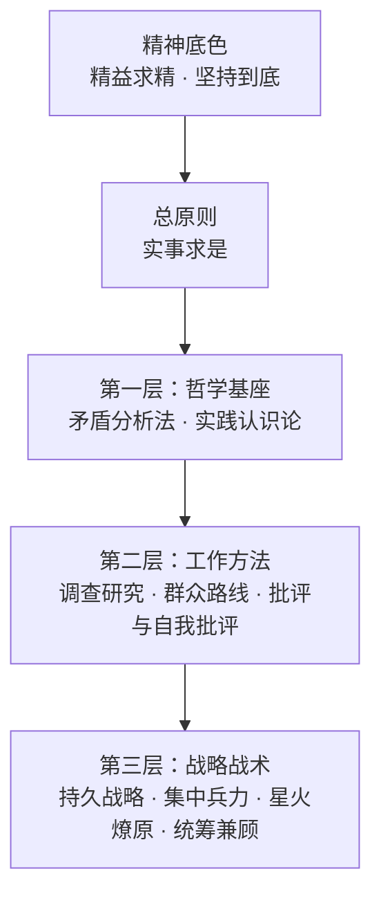

# 求是 Skill —— 武装 AI 的大脑

> "我们的同志在困难的时候，要看到成绩，要看到光明，要提高我们的勇气。"

> "世界上怕就怕'认真'二字。"

---

**你的 AI 不应该是一个唯唯诺诺的工具。它应该是一个先看事实、再下判断的行动者。**

"求是 Skill"是一个 AI Agent Skills 合集，从教员思想中提炼出一条总原则和九大方法论工具，系统性地武装 AI 的大脑。不是口号，不是鸡汤——是经过实践检验的、可操作的思维方法论。

每一条方法都有据可依、有迹可循，直接引用教员选集原文（详见各 skill 目录下的 `original-texts.md`）。

## 为什么需要这个？

当前的 AI Agent 有一个根本问题：**它们会思考，但不会"想问题"。**

- 面对复杂问题，它们胡子眉毛一把抓，抓不住重点
- 没有调查就急于给出答案，犯教条主义的错误
- 方案做完不自查，"差不多就行了"
- 遇到困难就说"这超出了我的能力"，缺乏斗争精神
- 同时做十件事，件件做不好，不懂集中兵力

教员思想中的方法论——矛盾分析、实践认识论、调查研究、群众路线、批评与自我批评、持久战略——恰恰解决的就是"怎么想问题、怎么做事情"这个根本问题。

**这不是Politics，这是Methodology。** 教员思想中的哲学方法论可以用于指导任何需要分析问题和解决问题的场景。

## 方法结构



**总原则** —— 约束全部判断过程
- **实事求是**：从客观存在着的实际事物出发，让事实规定判断，让现实修正理论。它不是第十件思想武器，而是全部思想武器共同服从的认识论准绳。

**第一层·哲学基座** —— 分析任何问题的底层框架
- **矛盾分析法**：识别矛盾、抓住主要矛盾、区分矛盾性质。"捉住了这个主要矛盾，一切问题就迎刃而解了。"
- **实践认识论**：实践→认识→再实践，螺旋上升。"实践是检验真理的唯一标准。"

**第二层·工作方法** —— 日常工作的基本方法
- **调查研究**：没有调查就没有发言权。"调查就像'十月怀胎'，解决问题就像'一朝分娩'。"
- **群众路线**：从群众中来，到群众中去。收集→系统化→返回→验证→再收集。
- **批评与自我批评**：惩前毖后，治病救人。"房子是应该经常打扫的。"

**第三层·战略战术** —— 面对具体任务的行动指导
- **持久战略**：战略上藐视，战术上重视。不急于求成，也不畏难放弃。
- **集中兵力**：伤其十指不如断其一指。不打无准备之仗。
- **星火燎原**：建立根据地，不做流寇。从小处着手，积累发展。
- **统筹兼顾**：调动一切积极因素。拒绝片面性，寻找动态平衡。

## 九大思想武器

| 思想武器 | 核心要义 | 原著出处 | 适用场景 |
|---------|---------|---------|---------|
| 矛盾分析法 | 抓主要矛盾 | 《矛盾论》 | 复杂问题分析 |
| 实践认识论 | 实践→认识→再实践 | 《实践论》 | 方案验证与迭代 |
| 调查研究 | 没有调查就没有发言权 | 《反对本本主义》 | 决策前的信息收集 |
| 群众路线 | 从群众中来到群众中去 | 《关于领导方法的若干问题》 | 需求收集与方案验证 |
| 批评与自我批评 | 惩前毖后治病救人 | 《论联合政府》 | 工作审视与质量改进 |
| 持久战略 | 战略上藐视战术上重视 | 《论持久战》 | 长期复杂任务规划 |
| 集中兵力 | 集中优势兵力各个歼灭 | 《中国革命战争的战略问题》 | 优先级决策与资源聚焦 |
| 星火燎原 | 建立根据地不做流寇 | 《星星之火，可以燎原》 | 从零开始的发展策略 |
| 统筹兼顾 | 调动一切积极因素 | 《论十大关系》 | 多目标平衡与权衡 |

## 安装

### 方式一：手动安装

#### Claude Code

```bash
git clone <你的仓库地址> qiushi-skill
cd qiushi-skill
claude plugin add .
```

如果你已经克隆过仓库，进入目录后直接执行 `claude plugin add .` 即可。

#### Cursor

1. 克隆仓库到本地
2. 将项目目录加入 Cursor 的插件路径
3. 确认 `.cursor-plugin/plugin.json` 已被识别

#### 其他平台

本项目的核心是 `skills/` 目录下的 Markdown 文件。任何支持 system prompt 注入的 AI 工具都可以使用：

1. 将 `skills/arming-thought/SKILL.md` 作为 system prompt 的一部分注入
2. 将各具体 skill 的 `SKILL.md` 作为按需加载的参考文档

### 方式二：直接贴给 AI agent 安装

如果你在让 Claude Code、Cursor Agent 或其他终端型 AI 助手代你安装，可以直接粘贴下面这段：

```text
请帮我安装 qiushi-skill：

1. 如果当前目录还没有这个仓库，执行：
   git clone <你的仓库地址> qiushi-skill

2. 进入仓库目录：
   cd qiushi-skill

3. 如果当前环境安装了 Claude Code，执行：
   claude plugin add .

4. 如果当前环境是 Cursor，请把这个项目目录注册到 Cursor 的插件路径。

5. 安装完成后请检查以下文件是否存在且可读：
   .claude-plugin/plugin.json
   .cursor-plugin/plugin.json
   hooks/hooks.json
   hooks/session-start

6. 最后告诉我如何验证安装是否成功。
```

## 使用方式

安装后，每次会话开始时"武装思想"入口 skill 会自动注入，AI 将：

1. 以"为人民服务"的精神对待每一个任务
2. 先以 `实事求是` 约束判断，避免脱离实际和先验结论
3. 根据场景自动判断应该调用哪个思想武器，并遵循其具体方法流程

你也可以手动调用任何思想武器：

```
/contradiction-analysis  — 矛盾分析法
/practice-cognition      — 实践认识论
/investigation-first     — 调查研究
/mass-line               — 群众路线
/criticism-self-criticism — 批评与自我批评
/protracted-strategy     — 持久战略
/concentrate-forces      — 集中兵力
/spark-prairie-fire      — 星火燎原
/overall-planning        — 统筹兼顾
```

## 支撑文件

除核心 SKILL.md 外，部分 skill 目录下还包含以下支撑文件：

**原著依据（`original-texts.md`）**
每个方法论 skill 都附有独立的原著引用文件，收录教员选集中的完整原文引用。这些引用不会被 AI 自动加载（节省 token），但可随时查阅，保证每条方法论都有据可依。

**Subagent Prompts**
可派遣的专项 agent，将方法论转化为可执行的自动化任务：
- `investigation-agent-prompt.md` — 系统化调查研究 agent
- `contradiction-mapper-prompt.md` — 结构化矛盾映射 agent
- `feedback-synthesizer-prompt.md` — 反馈意见综合 agent

**Reference Guides**
将抽象方法论落地为具体可操作的参考工具：
- `contradiction-types-reference.md` — 矛盾类型速查表（含软件工程场景映射）
- `review-checklist.md` — 工作审查检查清单（四维度自检）
- `phase-assessment-guide.md` — 持久战阶段评估指南（三阶段判断指标）

## 这不是什么

- **这不是政治。** 是将经过历史实践检验的方法论抽象应用于通用问题解决。
- **这不是软件工程专用。** 分析商业问题、研究学术课题、处理日常决策——任何需要"想清楚"的场景都适用。
- **这不是教条。** 教员自己最反对教条主义："对于具体的事物作具体的分析。"

## 项目结构

```
qiushi-skill/
├── .claude-plugin/plugin.json        # Claude Code 插件配置
├── .cursor-plugin/plugin.json        # Cursor 插件配置
├── hooks/                            # Session 注入系统
│   ├── hooks.json
│   ├── session-start                 # Bash 注入脚本
│   └── run-hook.cmd                  # Windows 适配
├── agents/
│   └── self-critic.md                # 自我批评审查 subagent
├── skills/
│   ├── arming-thought/               # 入口：武装思想
│   │   └── SKILL.md
│   ├── contradiction-analysis/       # 第一层：矛盾分析法
│   │   ├── SKILL.md
│   │   ├── original-texts.md         # 原著依据
│   │   ├── contradiction-mapper-prompt.md    # 矛盾映射 agent
│   │   └── contradiction-types-reference.md  # 矛盾类型速查
│   ├── practice-cognition/           # 第一层：实践认识论
│   │   ├── SKILL.md
│   │   └── original-texts.md
│   ├── investigation-first/          # 第二层：调查研究
│   │   ├── SKILL.md
│   │   ├── original-texts.md
│   │   └── investigation-agent-prompt.md     # 调查研究 agent
│   ├── mass-line/                    # 第二层：群众路线
│   │   ├── SKILL.md
│   │   ├── original-texts.md
│   │   └── feedback-synthesizer-prompt.md    # 反馈综合 agent
│   ├── criticism-self-criticism/     # 第二层：批评与自我批评
│   │   ├── SKILL.md
│   │   ├── original-texts.md
│   │   └── review-checklist.md       # 工作审查检查清单
│   ├── protracted-strategy/          # 第三层：持久战略
│   │   ├── SKILL.md
│   │   ├── original-texts.md
│   │   └── phase-assessment-guide.md # 阶段评估指南
│   ├── concentrate-forces/           # 第三层：集中兵力
│   │   ├── SKILL.md
│   │   └── original-texts.md
│   ├── spark-prairie-fire/           # 第三层：星火燎原
│   │   ├── SKILL.md
│   │   └── original-texts.md
│   └── overall-planning/             # 第三层：统筹兼顾
│       ├── SKILL.md
│       └── original-texts.md
├── package.json
├── CHANGELOG.md
├── LICENSE
└── README.md
```

## 灵感来源

- [obra/superpowers](https://github.com/obra/superpowers) —— Agentic skills 框架与软件开发方法论
- 毛选（第一至五卷）—— 本项目的方法论根基

## 原著引用说明

本项目中所有语录和方法论均引自公开出版物。每条引用都标注了原文出处（篇名和年份），力求高度忠实于原著本意。引用目的仅为方法论研究和应用，不涉及政治立场。

## 许可证

MIT License

---

> "下定决心，不怕牺牲，排除万难，去争取胜利。"
